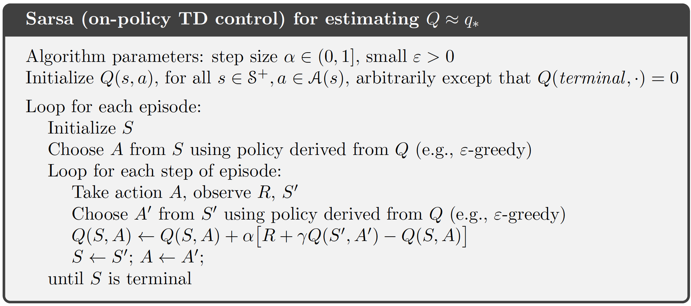

# Sutton's Windy Gridworld with Sarsa on-policy Time-Difference control

    Cross move with Steady wind     King move with Steady wind     King Move with Stochastic wind

<p float="center">
  
  
  
</p>

This project solves the Windy GridWorld problem in Sutton's textbook under various conditions, using Sarsa on-policy TD control.

This solution was written in C++ as main language, on Xcode 13.X platform. Visualization of race track requires installation of the SFML packages.
Unit testings were carried out using XCTest as well. All modules have tests except the visualization module, which cannot be supported by XCTest.

## Problem Statement:
A standard gridworld is shown in figure below, with start and goal states, but with one difference: there is a crosswind running upward through the middle of the grid. The actions are the standard cross movements: _**up, down, right,**_ and _**left**_. But in the middle region the resultant next states are shifted upward by a "wind", the strength of which varies from column to column. The strength of the wind is given below each column, in number of cells shifted upward. 


For example, if you are one to the right of the goal, then the action _**left**_ will takes you to the cell just above the goal. This is an undiscounted episodic task, with constant rewards of -1 until the goal state is reached.

There are a few variations to this problem, which will all be solved in this project:
1. Only cross (_**up, down, right, left**_) movements are available, and wind effects are steady (steady wind).
2. King (_**all eight directions**_) movements are available, with steady wind.
3. King movements are available, and wind effects are stochastic (has a _**uniformly random chance of varying up, none, or down**_ ).

## Solution Overview:
This project uses straightforward Sarsa on-policy TD control to train a target policy for the gridworld. TD-learning has tremendous advantage over Monte-Carlo control methods in problems like these: problems with _**"trap"**_ states, where a seemingly viable policy action can keep the system in a single state forever, causing the episode to never end. 

Since Monte-Carlo control relies on complete episodes, the training cannot continue if a trap state is found. However, TD control is an online learning method, which updates state-action values during an episode. Therefore, a trap state can be learned while the episode is ongoing, and be avoided by the policy after centain number of iterations. Such fundamental difference makes TD policy control the superior solution method for this problem.

A algorithm diagram for Sarsa TD control is shown below, taken from Sutton's textbook. Two state-action pairs selected according to a soft greedy policy (current and next) bootstrap in each update. As long as the full coverage condition is met, optimal greedy policy is guaranteed to converge after certain number of iterations.



## Essential Modules
Modules (Classes) needed for this problem are standard reinforcement learning modules used in other problems: enviroment (gridworld + environment response), agent (policy including choosing actions and updating state-action values), and visualization (SFML game module). Headers for each module are listed below for overview:

### GridWorld environment
This module consists a gridworld class to provide easy access to gridworld data:
```cpp
using vector_2D = std::vector<std::vector<int>>;

/// Class that stores and return a given grid world
class gridWorld
{
private:
    // To store the grid world
    vector_2D grid;
    // For easy access to starting and finishing positions
    std::tuple<int, int> startPos;
    std::tuple<int, int> goalPos;
    
public:
    /// Constructor of gridWorld class. Does not take any input as the GridWorld is pre-defined in problem.
    gridWorld(vector_2D inputGrid, std::tuple<int, int> inputStart, std::tuple<int, int> inputGoal);
    /// Returns the pre-defiend grid
    vector_2D getGrid() const;
    /// Returns the starting position
    std::tuple<int, int> getStart() const;
    /// Returns the goal position
    std::tuple<int, int> getGoal() const;
};

```
and an enviroment class to specifically return environment response:
```cpp
/// Struct to store the environment response
struct windyResponse
{
    // Stores the next state in GridWorld
    std::tuple<int, int> next_state;
    // Reward to current step
    int reward;
    // Whether the current episode is finished (goal reached)
    bool finished;
};

/// Class the simualtes the windy enviroment. Can return available actions given a state, and/or environment response given a state and an action
class windyEnv
{
private:
    // To store the given GridWorld
    vector_2D grid;
    // For easy access to the finishing position
    std::tuple<int, int> goalPos;
    // For easy access to the grid size
    int m, n;
    
public:
    /// Constructor of the Windy Environment
    /// @param inputWorld Input gridWorld class instance
    windyEnv(const gridWorld& inputWorld);
    /// Method that returns the full list of available cross moves (left, right, up, down) given a state
    /// @param curr_state Current state on the GridWorld
    std::vector<std::tuple<int, int>> availableCrossMoves(std::tuple<int, int> curr_state) const;
    /// Method that returns the full list of available king moves (left, right, up, down, and diagnals) given a state
    /// @param curr_state Current state on the GridWorld
    std::vector<std::tuple<int, int>> availableKingMoves(std::tuple<int, int> curr_state) const;
    /// Returns the environment response under steady wind (no random moves)
    /// @param curr_state Current state on the GridWorld
    /// @param curr_move Current action (move) to be applied on the state
    windyResponse getSteadyWindResp(std::tuple<int, int> curr_state, std::tuple<int, int> curr_move) const;
    /// Returns the environment response under stochastic wind (with random moves)
    /// @param curr_state Current state on the GridWorld
    /// @param curr_move Current action (move) to be applied on the state
    windyResponse getStochasticWindResp(std::tuple<int, int> curr_state, std::tuple<int, int> curr_move) const;
};
```

### Agent (Policy)

