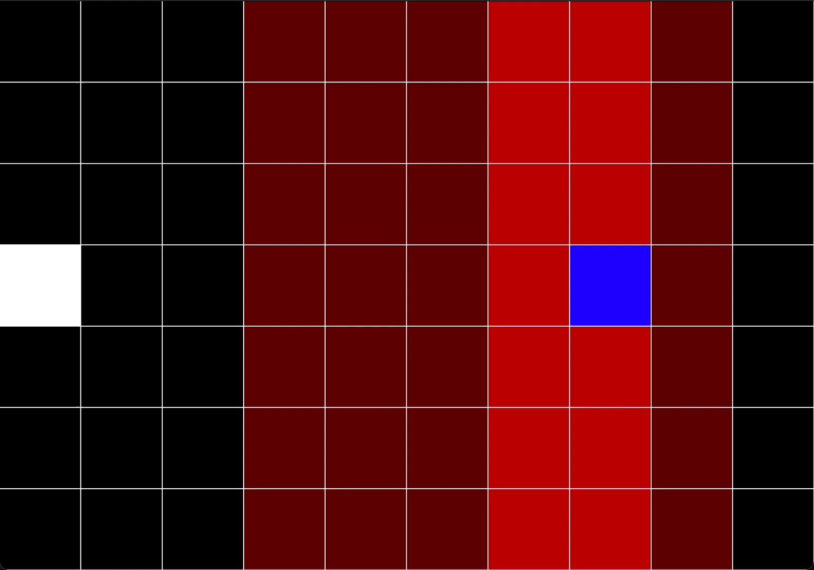
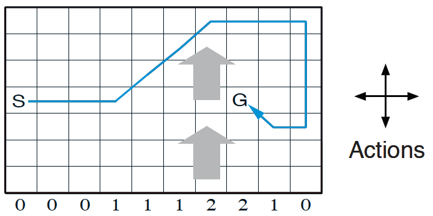

# Sutton's Windy Gridworld with Sarsa on-policy Time-Difference control

    Cross move with Steady wind     King move with Steady wind     King Move with Stochastic wind

  
  
  

This project solves the Windy GridWorld problem in Sutton's textbook under various conditions, using Sarsa on-policy TD control.

This solution was written in C++ as main language, on Xcode 13.X platform. Visualization of race track requires installation of the SFML packages.
Unit testings were carried out using XCTest as well. All modules have tests except the visualization module, which cannot be supported by XCTest.

## Problem Statement:
A standard gridworld is shown in figure below, with start and goal states, but with one difference: there is a crosswind running upward through the middle of the grid. The actions are the standard cross movements: _**up, down, right,**_ and _**left**_. But in the middle region the resultant next states are shifted upward by a "wind", the strength of which varies from column to column. The strength of the wind is given below each column, in number of cells shifted upward. 

For example, if you are one to the right of the goal, then the action _**left**_ will takes you to the cell just above the goal. This is an undiscounted episodic task, with constant rewards of -1 until the goal state is reached.

